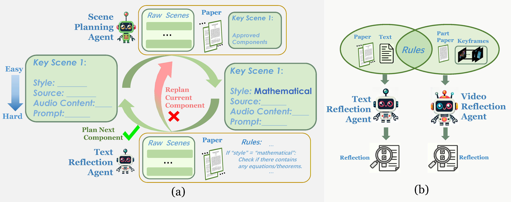
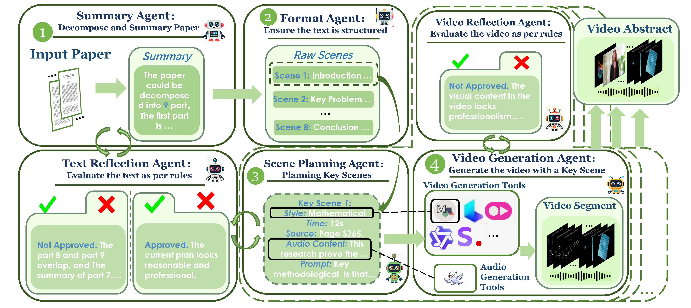
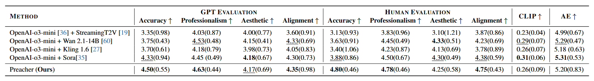

# Preacher: A Paper-to-Video Agentic System
[Jingwei Liu](https://scholar.google.com/citations?user=a4Mlw6QAAAAJ&hl=zh-CN&oi=ao)<sup>\*</sup>, [Ling Yang](https://yangling0818.github.io/)<sup>\*</sup>, [Hao Luo](https://scholar.google.com/citations?user=7QvWnzMAAAAJ&hl=zh-CN), [Fan Wang](https://scholar.google.com/citations?user=WCRGTHsAAAAJ&hl=zh-CN), [Hongyan Li](https://www.cis.pku.edu.cn/info/1177/1359.htm), [Mengdi Wang](https://ece.princeton.edu/people/mengdi-wang)

[Paper](https://arxiv.org/abs/2508.09632)

We present Preacher—an intelligent agent system that automatically transforms scientific papers into video abstracts. Inspired by how humans create video summaries, it adopts a top-down, hierarchical planning paradigm to produce generation-model-compatible scripts for video-abstract production, then invokes the appropriate video-creation tools to carry out the entire process autonomously.

## Quick Start
### Installation
```bash
conda create -n preacher python=3.10
conda activate preacher
pip install -r requirements.txt
```

### Setup
```python
input_path = Path("dataset/greengard.pdf").resolve()
output_dir = Path("output").resolve()
llm_config_path=Path("config.yml").resolve()

agent = Preacher(
    input_path=input_path, output_dir=output_dir, llm_config_path=llm_config_path,
    plan_by="GEMINI",
    eval_by="GEMINI",
    art_work="GEMINI",
    )
```

+ Put the paper PDF at 'dataset' document.
+ Set the 'input_path' as your pdf file path.
+ Here we simplify the configuration of the entire pipeline by reducing the multiple roles in the multi-agent framework to just three agent types. 'plan_by' specifies the agent used for planning; 'eval_by' specifies the agent used for review; 'art_work' specifies the agent used for creation. Set the parameters with your plan.
+ Fill in the API key in `config.yml` following the notice below.
+ Run `python run_pdf.py`.


### Notice
If you use the API, you must provide its corresponding API key. We have preset code for several agents, and you can also customize your own agent by following our examples. In addition, we currently use Qwen-tts, Wanx-2.2, Tavus, etc., as video-generation tools; if you wish to switch to others, you will need to reconfigure accordingly.

Different agent combinations can significantly affect the overall results.

This method relies on external APIs and incurs monetary costs—typically within a few dollars, depending on the chosen API provider.

## Case Study 
<table border="0" style="width:100%; text-align:center; margin-top:20px;">
  <tr>
    <td>
      <video src="https://github.com/user-attachments/assets/30700967-edd9-4923-bb20-cf2e9981c4b5"
             width="100%" controls autoplay loop></video>
      <p style="margin:4px 0; font-size:14px;">A Fast Algorithm for Particle Simulations, L. Greencard and V. Rokhlin, Journal of Computational Physics, 1987</p>
    </td>
    <td>
      <video src="https://github.com/user-attachments/assets/3513c00e-519e-461a-b523-672ab6daf49c"
             width="100%" controls autoplay loop></video>
      <p style="margin:4px 0; font-size:14px;">Aquaporins in Plants, Christophe Maurel and Yann Boursiac, et al, Physiol, 2015</p>
    </td>
  </tr>
  <tr>
    <td>
      <video src="https://github.com/user-attachments/assets/499a8f1c-2086-44e1-95cb-83e73f8e476e"
             width="100%" controls autoplay loop></video>
      <p style="margin:4px 0; font-size:14px;">A reinforced lunar dynamo recorded by Chang'e-6 farside basalt, Shuhui Cai and Kaixian Qi, et al, Nature, 2024</p>
    </td>
    <td>
      <video src="https://github.com/user-attachments/assets/6a4aa0d6-f6c2-4db5-b31e-5c2fadaf6e8f"
             width="100%" controls autoplay loop></video>
      <p style="margin:4px 0; font-size:14px;">On the Existence of Hermitian-Yang-Mills Connections in Stable Vector Bundles, K Uhlenbeck and ST Yau, Comm. Pure Appl. Math, 1986</p>
    </td>
  </tr>
</table>
 
## Workflow
Preacher operates in four iterative phases:
1. High-Level Planning – LLM reads the PDF and decides what scenes to create.
2. Low-Level Planning –  Preacher plans every detail of each video segment at a fine-grained level, thereby improving the usability of the agent’s planning results and reducing the error rate.
<p align="center">
  
</p>
 
  3. Video Generation – Calls the best engine (Manim, Wanxiang, Tavus, etc.) to produce visuals and audio. The evaluator agent evaluates the output of each stage and schedules regeneration for any deliverables that do not meet the criteria.
<p align="center">
  
</p>

## Evaluation
<p align="center">
  
</p>

We utilize GPT-4 to evaluate the quality of the final video, with GPT-4 providing scores ranging from 1 to 5 in the following aspects: (i) Accuracy: Correctness of the video content, free from errors. (ii) Professionalism: Use of domain-specific knowledge and expertise. (iii) Aesthetic Quality: Visual appeal, design, and overall presentation. (iv) Alignment with the Paper: Semantic Alignment with the paper. Additionally, we use the CLIP text-image similarity score (CLIP) and Aesthetic Score (AE) to evaluate the consistency with the prompt and aesthetic quality. Preacher outperforms existing methods in six out of ten metrics, notably in accuracy, professionalism, and alignment with the paper.


## Directory Layout (per run)

<pre>
```text
output/(PDFNAME)/
├── logs/
│   ├── llm_qa.md
│   ├── workflow.log
│   ├── highplan.txt
│   └── final_video.mp4
├── scene_0/
│   ├── audio.wav
│   ├── video.mp4
│   └── scene0.mp4
├── scene_1/
│   ├── audio.wav
│   ├── video.mp4
│   └── scene1.mp4
└── scene_2/
    ├── audio.wav
    ├── video.mp4
    └── scene2.mp4
```
</pre>
## Acknowledgement
We use Docling (https://github.com/docling-project/docling), Manim (https://github.com/3b1b/manim) and PyMol-open-source (https://github.com/schrodinger/pymol-open-source) to create professional video clip. Thanks for their open-source work. We also use Wanx (https://wan.video/), Qwen-tts (https://qwenlm.github.io/blog/qwen-tts/) and Tavus (https://www.tavus.io/) as video generation tools.
## BibTex
```
@misc{agenticir,
      title={Preacher: Paper-to-Video Agentic System}, 
      author={Jingwei Liu and Ling Yang and Hao Luo and Fan Wang and Hongyan Li and Mengdi Wang},
      year={2025},
      eprint={2508.09632},
      archivePrefix={arXiv},
      primaryClass={cs.CV},
      url={https://arxiv.org/abs/2508.09632}, 
}
```
